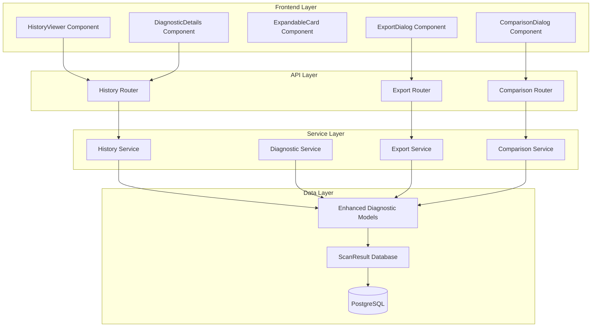

# Design Document

## Overview

The Enhanced History Diagnostics feature extends the existing scan history functionality by providing comprehensive diagnostic details for each scan run. This feature builds upon the current `ScanDiagnostics` model and `HistoryViewer` component to deliver an intuitive, collapsible interface that gives traders detailed visibility into scan performance, data quality, and troubleshooting information.

The design leverages the existing FastAPI backend with SQLAlchemy ORM and React frontend with Material-UI components, ensuring seamless integration with the current architecture while providing enhanced diagnostic capabilities.

## Architecture

### High-Level Architecture



### Data Flow

1. **Scan Execution**: Enhanced diagnostic data is collected during scan operations
2. **Storage**: Diagnostic data is stored in the existing `ScanResult` model with extended `ScanDiagnostics`
3. **Retrieval**: History API endpoints return enriched diagnostic information
4. **Display**: Frontend components render diagnostic data in collapsible, organized sections
5. **Export**: Diagnostic data can be exported in multiple formats for analysis
6. **Comparison**: Multiple scan results can be compared side-by-side

## Components and Interfaces

### Backend Components

#### Enhanced Data Models

**Extended ScanDiagnostics Model**
```python
@dataclass
class EnhancedScanDiagnostics:
    # Existing fields
    symbols_with_data: List[str]
    symbols_without_data: List[str]
    symbols_with_errors: Dict[str, str]
    data_fetch_time: float
    algorithm_time: float
    total_data_points: Dict[str, int]
    error_summary: Dict[str, int]
    
    # New enhanced fields
    symbol_details: Dict[str, SymbolDiagnostic]
    performance_metrics: PerformanceMetrics
    signal_analysis: SignalAnalysis
    data_quality_metrics: DataQualityMetrics
    settings_snapshot: AlgorithmSettings
```

**New Supporting Models**
```python
@dataclass
class SymbolDiagnostic:
    symbol: str
    status: str  # success, no_data, insufficient_data, error
    data_points_1m: int
    data_points_15m: int
    timeframe_coverage: Dict[str, bool]
    error_message: Optional[str]
    fetch_time: float
    processing_time: float

@dataclass
class PerformanceMetrics:
    memory_usage_mb: float
    api_requests_made: int
    api_rate_limit_remaining: int
    cache_hit_rate: float
    concurrent_requests: int
    bottleneck_phase: Optional[str]

@dataclass
class SignalAnalysis:
    signals_found: int
    symbols_meeting_partial_criteria: Dict[str, List[str]]
    rejection_reasons: Dict[str, List[str]]
    confidence_distribution: Dict[str, int]

@dataclass
class DataQualityMetrics:
    total_data_points: int
    success_rate: float
    average_fetch_time: float
    data_completeness: float
    quality_score: float
```

#### API Endpoints

**Enhanced History Endpoints**
```python
# Existing endpoint with enhanced response
@router.get("/scan-history", response_model=List[EnhancedScanResult])
async def get_scan_history_enhanced(
    filters: HistoryFilters = Depends(),
    include_diagnostics: bool = True
) -> List[EnhancedScanResult]:
    """Get scan history with enhanced diagnostic details"""

# New diagnostic-specific endpoints
@router.get("/scan-history/{scan_id}/diagnostics")
async def get_scan_diagnostics(scan_id: str) -> EnhancedScanDiagnostics:
    """Get detailed diagnostics for a specific scan"""

@router.post("/scan-history/compare")
async def compare_scans(scan_ids: List[str]) -> ScanComparison:
    """Compare multiple scans side-by-side"""

@router.post("/scan-history/export")
async def export_scan_data(
    export_request: ExportRequest
) -> FileResponse:
    """Export scan data in specified format"""
```

#### Service Layer

**DiagnosticService**
- Collects enhanced diagnostic data during scan execution
- Calculates performance metrics and data quality scores
- Provides analysis of signal generation patterns
- Manages diagnostic data persistence

**ComparisonService**
- Compares settings between multiple scans
- Identifies performance trends and differences
- Highlights significant changes in outcomes
- Generates comparison insights

**ExportService**
- Formats diagnostic data for export
- Supports CSV, JSON, and Excel formats
- Handles large dataset pagination
- Provides progress tracking for exports

### Frontend Components

#### Enhanced HistoryViewer Component

The existing `HistoryViewer` component will be enhanced with new diagnostic display capabilities while maintaining backward compatibility.

**New Props and State**
```typescript
interface EnhancedHistoryViewerProps {
  showDiagnostics?: boolean;
  defaultExpandedSections?: string[];
  enableComparison?: boolean;
  enableExport?: boolean;
}

interface EnhancedHistoryViewerState {
  expandedDiagnostics: Set<string>;
  selectedForComparison: Set<string>;
  comparisonMode: boolean;
  exportDialogOpen: boolean;
}
```

#### New DiagnosticDetails Component

**Component Structure**
```typescript
interface DiagnosticDetailsProps {
  scanResult: EnhancedScanResult;
  expanded: boolean;
  onToggle: () => void;
  showExportButton?: boolean;
}

const DiagnosticDetails: React.FC<DiagnosticDetailsProps> = ({
  scanResult,
  expanded,
  onToggle,
  showExportButton = true
}) => {
  return (
    <ExpandableCard
      title="Diagnostic Details"
      expanded={expanded}
      onToggle={onToggle}
    >
      <ScanSettingsSection settings={scanResult.settings_used} />
      <SymbolsScannedSection diagnostics={scanResult.diagnostics} />
      <DataQualitySection metrics={scanResult.diagnostics.data_quality_metrics} />
      <ErrorDetailsSection errors={scanResult.diagnostics.symbols_with_errors} />
      <SignalAnalysisSection analysis={scanResult.diagnostics.signal_analysis} />
      <PerformanceMetricsSection metrics={scanResult.diagnostics.performance_metrics} />
      {showExportButton && <ExportButton scanId={scanResult.id} />}
    </ExpandableCard>
  );
};
```

#### Diagnostic Section Components

**ScanSettingsSection**
- Displays algorithm parameters in organized groups
- Highlights non-default settings with visual indicators
- Shows parameter descriptions and units
- Provides tooltips for complex settings

**SymbolsScannedSection**
- Categorizes symbols by processing status
- Shows clickable symbol badges with color coding
- Displays detailed symbol information in expandable cards
- Provides filtering and search within symbols

**DataQualitySection**
- Shows key quality metrics with progress indicators
- Displays timing breakdowns with visual charts
- Highlights quality issues with warning indicators
- Provides quality score with explanatory tooltips

**ErrorDetailsSection**
- Groups errors by type with expandable lists
- Shows actionable error descriptions
- Provides remediation suggestions
- Displays error frequency and patterns

**SignalAnalysisSection**
- Shows signal generation statistics
- Displays rejection reasons with counts
- Provides confidence distribution charts
- Shows symbols meeting partial criteria

**PerformanceMetricsSection**
- Displays system performance indicators
- Shows API rate limit status
- Provides memory usage and timing metrics
- Highlights performance bottlenecks

#### Supporting Components

**ExpandableCard Component**
```typescript
interface ExpandableCardProps {
  title: string;
  subtitle?: string;
  expanded: boolean;
  onToggle: () => void;
  children: React.ReactNode;
  actions?: React.ReactNode;
  severity?: 'info' | 'warning' | 'error' | 'success';
}
```

**SymbolBadge Component**
```typescript
interface SymbolBadgeProps {
  symbol: string;
  status: 'success' | 'warning' | 'error' | 'no-data';
  onClick?: () => void;
  showDetails?: boolean;
  diagnostic?: SymbolDiagnostic;
}
```

**ComparisonDialog Component**
- Side-by-side comparison of multiple scans
- Highlights differences in settings and outcomes
- Shows trend indicators for performance metrics
- Provides insights about significant changes

**ExportDialog Component**
- Format selection (CSV, JSON, Excel)
- Date range and filter options
- Progress tracking for large exports
- Download management

## Data Models

### Enhanced Database Schema

The existing `ScanResult` table will be extended to support enhanced diagnostics through JSON columns, leveraging PostgreSQL's JSONB capabilities.

**Extended ScanResult Table**
```sql
ALTER TABLE scan_results ADD COLUMN enhanced_diagnostics JSONB;
ALTER TABLE scan_results ADD COLUMN performance_metrics JSONB;
ALTER TABLE scan_results ADD COLUMN signal_analysis JSONB;
ALTER TABLE scan_results ADD COLUMN data_quality_score FLOAT;

-- Indexes for efficient querying
CREATE INDEX idx_scan_results_quality_score ON scan_results(data_quality_score);
CREATE INDEX idx_scan_results_enhanced_diagnostics ON scan_results USING GIN(enhanced_diagnostics);
CREATE INDEX idx_scan_results_performance_metrics ON scan_results USING GIN(performance_metrics);
```

### Data Validation

**Pydantic Models for Validation**
```python
class EnhancedScanDiagnosticsModel(BaseModel):
    symbols_with_data: List[str]
    symbols_without_data: List[str]
    symbols_with_errors: Dict[str, str]
    symbol_details: Dict[str, SymbolDiagnosticModel]
    performance_metrics: PerformanceMetricsModel
    signal_analysis: SignalAnalysisModel
    data_quality_metrics: DataQualityMetricsModel
    
    class Config:
        json_encoders = {
            datetime: lambda v: v.isoformat(),
            float: lambda v: round(v, 4)
        }
```

## Error Handling

### Backend Error Handling

**Diagnostic Collection Errors**
- Graceful degradation when diagnostic collection fails
- Fallback to basic diagnostics if enhanced collection errors
- Error logging with context for troubleshooting
- Retry mechanisms for transient failures

**API Error Responses**
```python
class DiagnosticError(Exception):
    """Base exception for diagnostic-related errors"""
    pass

class DiagnosticCollectionError(DiagnosticError):
    """Error during diagnostic data collection"""
    pass

class DiagnosticExportError(DiagnosticError):
    """Error during diagnostic data export"""
    pass

# Error handlers
@app.exception_handler(DiagnosticError)
async def diagnostic_error_handler(request: Request, exc: DiagnosticError):
    return JSONResponse(
        status_code=500,
        content={
            "error": "diagnostic_error",
            "message": str(exc),
            "fallback_available": True
        }
    )
```

### Frontend Error Handling

**Component Error Boundaries**
- Isolated error handling for diagnostic sections
- Fallback UI when diagnostic data is unavailable
- User-friendly error messages with retry options
- Progressive enhancement approach

**Error Recovery Strategies**
- Retry failed diagnostic loads
- Show partial data when available
- Provide manual refresh options
- Cache successful diagnostic data

## Testing Strategy

### Backend Testing

**Unit Tests**
- Test enhanced diagnostic data collection
- Validate data model serialization/deserialization
- Test comparison and export functionality
- Mock external dependencies (database, APIs)

**Integration Tests**
- Test complete diagnostic flow from scan to display
- Validate API endpoint responses
- Test database operations with real data
- Performance testing for large diagnostic datasets

**Test Coverage Requirements**
- Minimum 85% coverage for diagnostic services
- 90% coverage for data models
- 80% coverage for API endpoints

### Frontend Testing

**Component Tests**
- Test diagnostic section rendering
- Validate user interactions (expand/collapse)
- Test export and comparison functionality
- Mock API responses for consistent testing

**Integration Tests**
- Test complete user workflows
- Validate accessibility compliance
- Test responsive design across devices
- Performance testing for large diagnostic datasets

**Accessibility Testing**
- Screen reader compatibility
- Keyboard navigation support
- Color contrast compliance
- Focus management in dynamic content

### Performance Testing

**Backend Performance**
- Load testing with large diagnostic datasets
- Memory usage monitoring during collection
- Database query optimization validation
- API response time benchmarking

**Frontend Performance**
- Rendering performance with large symbol lists
- Memory usage in long-running sessions
- Bundle size impact assessment
- Mobile device performance validation

## Security Considerations

### Data Privacy
- Ensure diagnostic data doesn't expose sensitive information
- Implement proper access controls for diagnostic endpoints
- Sanitize error messages to prevent information leakage
- Audit logging for diagnostic data access

### Export Security
- Validate export requests to prevent data exfiltration
- Implement rate limiting for export operations
- Secure file generation and cleanup
- User authentication for export functionality

### API Security
- Input validation for all diagnostic endpoints
- SQL injection prevention in dynamic queries
- Cross-site scripting (XSS) protection
- Rate limiting for diagnostic API calls

## Performance Optimization

### Backend Optimization
- Lazy loading of diagnostic details
- Database query optimization with proper indexing
- Caching of frequently accessed diagnostic data
- Asynchronous processing for expensive operations

### Frontend Optimization
- Virtual scrolling for large symbol lists
- Memoization of expensive calculations
- Code splitting for diagnostic components
- Progressive loading of diagnostic sections

### Database Optimization
- Efficient JSONB queries for diagnostic data
- Proper indexing strategy for common queries
- Data archiving for old diagnostic records
- Connection pooling optimization

## Migration Strategy

### Database Migration
1. Add new columns to existing `scan_results` table
2. Migrate existing diagnostic data to enhanced format
3. Create new indexes for performance
4. Validate data integrity after migration

### API Migration
1. Maintain backward compatibility with existing endpoints
2. Add new enhanced endpoints alongside existing ones
3. Implement feature flags for gradual rollout
4. Deprecate old endpoints after transition period

### Frontend Migration
1. Enhance existing components with new functionality
2. Implement progressive enhancement approach
3. Maintain existing UI while adding new features
4. Provide user preferences for diagnostic detail level

## Deployment Considerations

### Feature Flags
- Enable/disable enhanced diagnostics collection
- Control diagnostic detail level per user
- A/B testing for new diagnostic features
- Gradual rollout to monitor performance impact

### Monitoring
- Track diagnostic collection performance
- Monitor API response times for diagnostic endpoints
- Alert on diagnostic collection failures
- User engagement metrics for diagnostic features

### Rollback Strategy
- Ability to disable enhanced diagnostics quickly
- Fallback to basic diagnostic display
- Data preservation during rollbacks
- Quick recovery procedures for issues