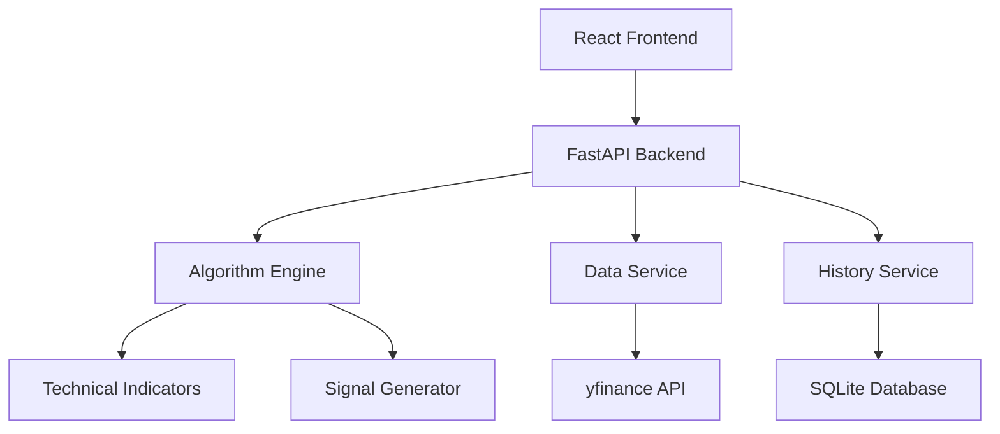

# Design Document

## Overview

The stock scanner is a web-based application that implements a sophisticated EMA-ATR trading algorithm with higher timeframe confirmation. The system consists of a Python backend using FastAPI for API services, a React frontend for user interaction, and PostgreSQL for data persistence. The application integrates with yfinance to fetch real-time and historical market data, processes it through the custom algorithm, and provides both live scanning and historical backtesting capabilities.

## Architecture

### System Architecture



### Component Overview

- **Frontend (React)**: User interface for scanning, backtesting, and viewing results
- **Backend (FastAPI)**: REST API handling requests and orchestrating services
- **Algorithm Engine**: Core trading logic implementing the EMA-ATR strategy
- **Data Service**: Market data fetching and caching using yfinance
- **History Service**: Persistence and retrieval of scan/backtest results
- **Database (PostgreSQL)**: Robust storage for historical runs and results with concurrent access support

## Components and Interfaces

### Frontend Components

#### ScannerDashboard
- **Purpose**: Main interface for initiating scans and viewing results
- **Props**: None (root component)
- **State**: Current scan results, loading status, error messages
- **Methods**: `initiateScan()`, `viewHistory()`, `configureSettings()`

#### BacktestInterface  
- **Purpose**: Interface for running historical backtests
- **Props**: None
- **State**: Date range, backtest parameters, results
- **Methods**: `runBacktest()`, `exportResults()`, `viewDetails()`

#### HistoryViewer
- **Purpose**: Display and filter historical runs
- **Props**: `runs: Array<RunResult>`
- **State**: Filter criteria, pagination
- **Methods**: `filterRuns()`, `loadMore()`, `viewRunDetails()`

#### SettingsPanel
- **Purpose**: Configure algorithm parameters
- **Props**: `currentSettings: AlgorithmSettings`
- **State**: Parameter values, validation errors
- **Methods**: `updateSettings()`, `resetToDefaults()`, `validateInputs()`

### Backend Services

#### ScannerService
```python
class ScannerService:
    def scan_stocks(self, symbols: List[str], settings: AlgorithmSettings) -> ScanResult
    def get_scan_history(self, filters: HistoryFilters) -> List[ScanResult]
    def save_scan_result(self, result: ScanResult) -> str
```

#### BacktestService
```python
class BacktestService:
    def run_backtest(self, symbols: List[str], start_date: date, end_date: date, settings: AlgorithmSettings) -> BacktestResult
    def get_backtest_history(self, filters: HistoryFilters) -> List[BacktestResult]
    def calculate_performance_metrics(self, trades: List[Trade]) -> PerformanceMetrics
```

#### DataService
```python
class DataService:
    def fetch_current_data(self, symbols: List[str]) -> Dict[str, MarketData]
    def fetch_historical_data(self, symbols: List[str], start_date: date, end_date: date) -> Dict[str, HistoricalData]
    def get_higher_timeframe_data(self, symbol: str, timeframe: str) -> MarketData
```

#### AlgorithmEngine
```python
class AlgorithmEngine:
    def calculate_indicators(self, data: MarketData) -> TechnicalIndicators
    def evaluate_long_conditions(self, indicators: TechnicalIndicators, htf_data: MarketData) -> bool
    def evaluate_short_conditions(self, indicators: TechnicalIndicators, htf_data: MarketData) -> bool
    def generate_signals(self, data: MarketData, settings: AlgorithmSettings) -> List[Signal]
```

## Data Models

### Core Models

```python
@dataclass
class MarketData:
    symbol: str
    timestamp: datetime
    open: float
    high: float
    low: float
    close: float
    volume: int

@dataclass
class TechnicalIndicators:
    ema5: float
    ema8: float
    ema13: float
    ema21: float
    ema50: float
    atr: float
    atr_long_line: float
    atr_short_line: float

@dataclass
class Signal:
    symbol: str
    signal_type: str  # 'long' or 'short'
    timestamp: datetime
    price: float
    indicators: TechnicalIndicators
    confidence: float

@dataclass
class AlgorithmSettings:
    atr_multiplier: float = 2.0
    ema5_rising_threshold: float = 0.02
    ema8_rising_threshold: float = 0.01
    ema21_rising_threshold: float = 0.005
    volatility_filter: float = 1.5
    fomo_filter: float = 1.0
    higher_timeframe: str = "15m"

@dataclass
class ScanResult:
    id: str
    timestamp: datetime
    symbols_scanned: List[str]
    signals_found: List[Signal]
    settings_used: AlgorithmSettings
    execution_time: float

@dataclass
class BacktestResult:
    id: str
    timestamp: datetime
    start_date: date
    end_date: date
    symbols: List[str]
    trades: List[Trade]
    performance: PerformanceMetrics
    settings_used: AlgorithmSettings

@dataclass
class Trade:
    symbol: str
    entry_date: datetime
    entry_price: float
    exit_date: datetime
    exit_price: float
    trade_type: str  # 'long' or 'short'
    pnl: float
    pnl_percent: float

@dataclass
class PerformanceMetrics:
    total_trades: int
    winning_trades: int
    losing_trades: int
    win_rate: float
    total_return: float
    average_return: float
    max_drawdown: float
    sharpe_ratio: float
```

### Database Schema

```sql
-- Scan results table
CREATE TABLE scan_results (
    id UUID PRIMARY KEY DEFAULT gen_random_uuid(),
    timestamp TIMESTAMPTZ NOT NULL,
    symbols_scanned JSONB NOT NULL,
    signals_found JSONB NOT NULL,
    settings_used JSONB NOT NULL,
    execution_time DECIMAL(10,3) NOT NULL,
    created_at TIMESTAMPTZ DEFAULT NOW(),
    updated_at TIMESTAMPTZ DEFAULT NOW()
);

-- Backtest results table
CREATE TABLE backtest_results (
    id UUID PRIMARY KEY DEFAULT gen_random_uuid(),
    timestamp TIMESTAMPTZ NOT NULL,
    start_date DATE NOT NULL,
    end_date DATE NOT NULL,
    symbols JSONB NOT NULL,
    trades JSONB NOT NULL,
    performance JSONB NOT NULL,
    settings_used JSONB NOT NULL,
    created_at TIMESTAMPTZ DEFAULT NOW(),
    updated_at TIMESTAMPTZ DEFAULT NOW()
);

-- Individual trades table (for detailed analysis and indexing)
CREATE TABLE trades (
    id UUID PRIMARY KEY DEFAULT gen_random_uuid(),
    backtest_id UUID NOT NULL,
    symbol VARCHAR(10) NOT NULL,
    entry_date TIMESTAMPTZ NOT NULL,
    entry_price DECIMAL(12,4) NOT NULL,
    exit_date TIMESTAMPTZ,
    exit_price DECIMAL(12,4),
    trade_type VARCHAR(10) NOT NULL CHECK (trade_type IN ('long', 'short')),
    pnl DECIMAL(12,4),
    pnl_percent DECIMAL(8,4),
    created_at TIMESTAMPTZ DEFAULT NOW(),
    FOREIGN KEY (backtest_id) REFERENCES backtest_results(id) ON DELETE CASCADE
);

-- Indexes for performance
CREATE INDEX idx_scan_results_timestamp ON scan_results(timestamp DESC);
CREATE INDEX idx_backtest_results_timestamp ON backtest_results(timestamp DESC);
CREATE INDEX idx_backtest_results_date_range ON backtest_results(start_date, end_date);
CREATE INDEX idx_trades_backtest_id ON trades(backtest_id);
CREATE INDEX idx_trades_symbol ON trades(symbol);
CREATE INDEX idx_trades_entry_date ON trades(entry_date);
```

## Error Handling

### API Error Handling
- **Network Errors**: Implement retry logic with exponential backoff for yfinance API calls
- **Rate Limiting**: Handle API rate limits with appropriate delays and user notifications
- **Data Validation**: Validate all incoming data and provide clear error messages for invalid inputs
- **Timeout Handling**: Set reasonable timeouts for all external API calls

### Application Error Handling
- **Algorithm Errors**: Gracefully handle cases where technical indicators cannot be calculated
- **Database Errors**: Implement fallback mechanisms for database connectivity issues
- **Memory Management**: Handle large datasets efficiently to prevent memory overflow
- **Concurrent Access**: Manage multiple simultaneous scans and backtests safely

### User Experience Error Handling
- **Loading States**: Show progress indicators for long-running operations
- **Error Messages**: Display user-friendly error messages with actionable guidance
- **Fallback UI**: Provide alternative interfaces when primary features are unavailable
- **Data Recovery**: Implement mechanisms to recover from partial failures

## Testing Strategy

### Unit Testing
- **Algorithm Engine**: Test all indicator calculations and signal generation logic
- **Data Service**: Mock yfinance API responses and test data transformation
- **Services**: Test business logic with various input scenarios
- **Models**: Validate data model serialization and validation

### Integration Testing
- **API Endpoints**: Test all REST endpoints with realistic data
- **Database Operations**: Test CRUD operations and data integrity
- **External APIs**: Test yfinance integration with real and mocked data
- **End-to-End Workflows**: Test complete scan and backtest workflows

### Performance Testing
- **Load Testing**: Test system performance with large stock lists
- **Memory Usage**: Monitor memory consumption during intensive operations
- **Response Times**: Ensure acceptable response times for all operations
- **Concurrent Users**: Test system behavior with multiple simultaneous users

### Frontend Testing
- **Component Testing**: Test React components in isolation
- **User Interaction**: Test user workflows and form validations
- **Responsive Design**: Test interface across different screen sizes
- **Error Scenarios**: Test UI behavior during error conditions